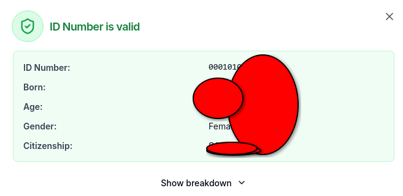

# South African ID Number Generator

Generates valid South African ID numbers based on date ranges using the standard [Luhn algorithm](https://en.wikipedia.org/wiki/Luhn_algorithm) for check digit computation. No external dependencies required.



## Features

- Generates SA ID numbers for configurable date ranges (default: 1900 to current year)
- Multiprocessing for fast parallel generation across CPU cores
- Live progress reporting (percentage, count, throughput)
- Handles leap years and month-day limits correctly
- Covers all gender sequences (0000-9999) and citizenship values (0-1)
- Built-in Luhn + date validation via `--validate` (no external library needed)
- Limit output count with `-n` / `--limit`
- Dry-run mode to estimate output size before generating

## Requirements

- Python 3.7+
- No external dependencies

## Usage

```bash
# Generate all IDs from 1900 to current year (default)
python gen.py

# Custom range with output file
python gen.py -s 1980 -e 2000 -o sa_ids_1980_2000.txt

# Generate only 200 IDs with validation
python gen.py --validate -n 200

# Use 8 workers
python gen.py -w 8

# Estimate output size without generating
python gen.py --dry-run
```

### CLI Options

| Flag | Description | Default |
|------|-------------|---------|
| `-s`, `--start-year` | Start year | 1900 |
| `-e`, `--end-year` | End year | Current year |
| `-o`, `--output` | Output file path | `valid_ids.txt` |
| `-w`, `--workers` | Parallel worker count | CPU count |
| `-n`, `--limit` | Stop after N IDs | Unlimited |
| `--validate` | Verify each ID (Luhn + date check) | Off |
| `--dry-run` | Estimate output size only | Off |

## How It Works

SA ID format: `YYMMDDSSSSCAZ`

| Segment | Meaning |
|---------|---------|
| `YY` | Year of birth |
| `MM` | Month of birth |
| `DD` | Day of birth |
| `SSSS` | Sequence/gender (0000-4999 female, 5000-9999 male) |
| `C` | Citizenship (0 = SA citizen, 1 = permanent resident) |
| `A` | Former race digit (now fixed at 8) |
| `Z` | Luhn check digit |

The generator constructs all valid date/sequence/citizenship combinations, computes the standard Luhn check digit for each, and writes the results to file.

## Notes

- Full generation (1900-2026) produces ~900 million IDs (~12 GB).
- Validation is fast (inline Luhn + date check, no external library).
- Memory usage scales per-month (~8 MB per worker).

## Contributing

1. Fork the repository
2. Create a feature branch (`git checkout -b feature/your-feature`)
3. Commit your changes (`git commit -m 'Add some feature'`)
4. Push to the branch (`git push origin feature/your-feature`)
5. Open a pull request

## License

GPL - see [LICENSE](LICENSE).
